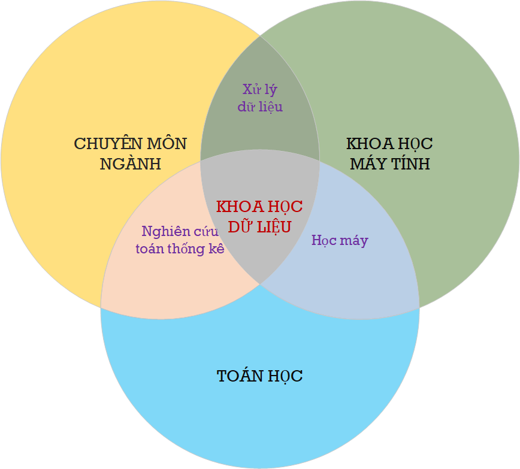
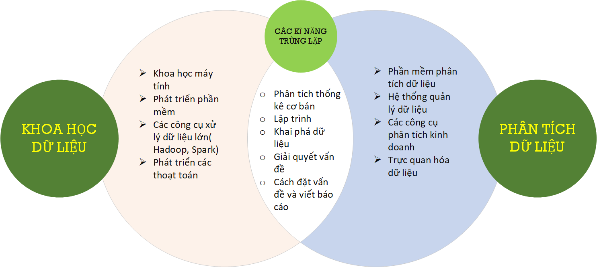
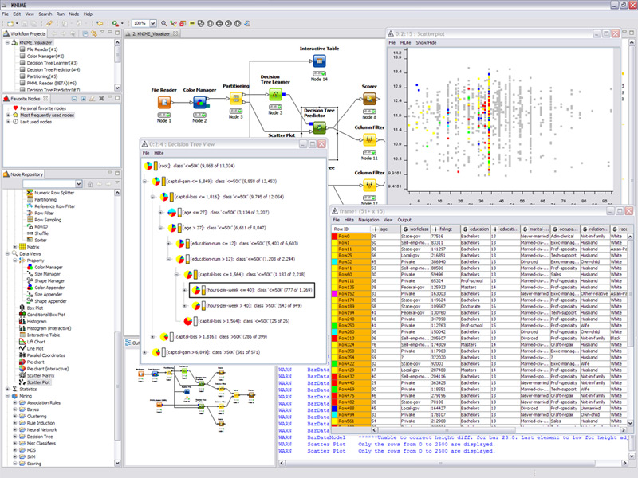

```{r setup, include=FALSE}
knitr::opts_chunk$set(echo = FALSE)
```

## Giới Thiệu Bản Thân


<div class='left' style='float:left;width:50%'>
- Tiểu Sử
  - Ngành nghiên cứu chính về phân tích rủi do bằng phương pháp định lượng và quản lý cơ sở hạ tầng xây dựng và các hệ thống kĩ thuật. 
  - 4 năm sống ở Nhật (làm Tiến Sĩ tại Đại Học Kyoto và 1  năm làm nghiên cứu sau TS tại ĐH Osaka, Nhật Bản)
  - <2 năm ở Thái Lan (học Thạc Sĩ tại AIT từ năm 2002-2004)
  - 6+ năm sống ở Thụy Sĩ (2010-2016, giảng dạy và nghiên cứu tại học viện kĩ thuật liên bang Thụy Sĩ, ETH Zurich)
  - 6 năm làm tư vấn tại Manila, Philippines (2016-2021) cho 2 công ty (GHD và Arcadis)
  - Từ cuối năm 2021, sống ở thủ đô New Delhi, Ấn Độ và thường xuyên về Việt Nam tham gia giảng dạy.


- Các môn thể thao yêu thích
  - Chạy bộ đường dài `r emo::ji("running")``r emo::ji("running")``r emo::ji("running_man")`
  - Lặn biển `r emo::ji("swimming_man")`
  - và một số môn khác ^_^ `r emo::ji("smile")``r emo::ji("smiling_imp")`

</div>
<div class='right' style='float:right;width:50%'>

```{r attr.source="style='display:inline-block;'", collapse=TRUE, echo = FALSE, message=FALSE,warning=FALSE}
source("../code/bio.R")
p
```
</div>


##  Giới Thiệu Bản Thân


<div class='left' style='float:left;width:50%'>

```{r attr.source="style='display:inline-block;'", collapse=TRUE, echo = FALSE, message=FALSE,warning=FALSE}
source("../code/bio.R")
q
```

</div>

<div class='right' style='float:right;width:50%'>

```{r attr.source="style='display:inline-block;'", collapse=TRUE, echo = FALSE, message=FALSE,warning=FALSE}
source("../code/bio.R")
ggplotly(w)
```
</div>

## Thành Viên của Lớp

```{r, echo=FALSE, out.width="80%", fig.cap="", fig.align = 'center',collapse=TRUE, echo = FALSE, message=FALSE,warning=FALSE}
library(DT)
library(tidyverse)
library(readxl)
library(lubridate)
df=read_excel("../data/hocvien.xlsx",sheet="Sheet1",skip = 0)
df$`Ngày Sinh` <- dmy(df$`Ngày Sinh`)
p <- datatable(df,rownames = FALSE, filter = 'top',
          options = list(pageLength = 10,autoWidth = TRUE)
          )
p
```

##  Thành Viên của Lớp


<div class='left' style='float:left;width:50%'>

```{r attr.source="style='display:inline-block;'", collapse=TRUE, echo = FALSE, message=FALSE,warning=FALSE}
source("../code/hocvien.R")
boxplot(df$namsinh,
    #    main = "Mean ozone in parts per billion at Roosevelt Island",
        xlab = "Năm Sinh",
        ylab = "",
        col = "orange",
        border = "brown",
        horizontal = TRUE,
        notch = TRUE
)
```

</div>

<div class='right' style='float:right;width:50%'>

```{r attr.source="style='display:inline-block;'", collapse=TRUE, echo = FALSE, message=FALSE,warning=FALSE}
source("../code/hocvien.R")
ggplotly(p3)
```
</div>


## Chương Trình Học và Thời Khóa Biểu


```{r, echo=FALSE, out.width="80%", fig.cap="", fig.align = 'center',collapse=TRUE, echo = FALSE, message=FALSE,warning=FALSE}
source("../code/schedule.R")
p
```


## Mong Muốn và Yêu Cầu

```{r, echo=FALSE, out.width="60%", fig.cap="", fig.align = 'center'}
library(ggplot2)

# Create test data.
data <- data.frame(
  category=c("Học Trên Lớp", "Thảo Luận và Trình Bày", "Bài Thi"),
 count=c(40, 30, 30)
)

# Compute percentages
data$fraction <- data$count / sum(data$count)

# Compute the cumulative percentages (top of each rectangle)
data$ymax <- cumsum(data$fraction)

# Compute the bottom of each rectangle
data$ymin <- c(0, head(data$ymax, n=-1))

# Compute label position
data$labelPosition <- (data$ymax + data$ymin) / 2

# Compute a good label
data$label <- paste0(data$category, "\n value: ", data$count)

# Make the plot
ggplot(data, aes(ymax=ymax, ymin=ymin, xmax=4, xmin=3, fill=category)) +
  geom_rect() +
  geom_label( x=3.5, aes(y=labelPosition, label=label), size=6) +
  scale_fill_brewer(palette=4) +
  coord_polar(theta="y") +
  xlim(c(2, 4)) +
  theme_void() +
  theme(legend.position = "none")
```


## Khoa Học về Dữ Liệu (1) - Sơ đồ Venn


```{r, echo=FALSE, out.width="40%", fig.cap="", fig.align = 'center'}

```

## Khoa Học về Dữ Liệu (2) - Khoa Học Dữ Liệu vs Phân Tích Dữ Liệu

```{r, echo=FALSE, out.width="80%", fig.cap="", fig.align = 'center'}

```


## Khoa Học về Dữ Liệu (3) - Khoa Học Dữ Liệu vs Phân Tích Dữ Liệu


<div class='left' style='float:left;width:30%'>
- Một vài phương pháp tính toán xác xuất thống kê cơ bản
- Dữ liệu và Dữ Liệu Sạch
- Cơ bản về quản lý dữ liệu
- Giới thiệu sơ qua về phần mềm R
- Học cơ bản về nền tảng phân tích KNIME và PowerBI
- Các công cụ phân tích khác
- Cơ bản về trực quan hóa dữ liệu
- Các kết luận rút ra từ phân tích dữ liệu
</div>

<div class='left' style='float:left;width:60%'>
```{r, echo=FALSE, out.width="100%", fig.cap="", fig.align = 'center'}
knitr::include_graphics("assets/img/Data-Engineer-vs-Data-Scientist-vs-Data-Analyst.png")
```
</div>


## Các Bước Trong Phân Tích Dữ Liệu


```{r, echo=FALSE, out.width="80%", fig.cap="", fig.align = 'center'}
knitr::include_graphics("assets/img/data-science-explore.png")
```


## Vậy Học Thì Có Gì Là Bổ Ích?


<div class='left' style='float:left;width:48%'>


```{r, echo=FALSE, out.width="80%", fig.cap="", fig.align = 'center'}
knitr::include_graphics("assets/img/cartoon01.png")
```

</div>

<div class='right' style='float:right;width:48%'>

**Bạn không cần phải trở thành một nhà nghiên cứu dữ liệu hay phân tích dữ liệu toàn thời gian, nhưng bạn có thể hiểu và làm công việc liên quan đến phân tích dữ liệu hiệu quả.**

- Thu thập dữ liệu và ghi dữ liệu một cách bài bản và hợp lý
- Sự khác biệt cơ bạn của các hệ thống quản lý dữ liệu
- Tự động hóa và sao lại qui trình công việc (workflow)
- Nâng cao năng xuất và tính hiệu quả trong công việc
- Chuyển đổi (số)

</div>


## Tài Liệu Tham Khảo


<div class='left' style='float:left;width:48%'>
- Sách và Hệ Thống
  - [R for Data Science](https://r4ds.had.co.nz/index.html)
  - [Elegant Graphics for Data Analysis](https://ggplot2-book.org/index.html)
  - [Github](https://github.com/)
  - [R Statistical Computing](https://www.r-project.org/) and  [Rstudio](https://www.rstudio.com/)
  - [R Graph Gallery](https://www.r-graph-gallery.com/)
  - [Plotly R Open Source Graphing Library](https://plotly.com/r/)
  - [Bookdown](https://bookdown.org/)s
  <!-- - [Stat545](https://stat545.com/index.html) -->
- Các gói thư Viện R
  - [Tidyverse](https://www.tidyverse.org/), [Dplyr](https://dplyr.tidyverse.org/), [Ggplot2](https://ggplot2.tidyverse.org/), [DT](https://rstudio.github.io/DT/),  [Rattle](https://rattle.togaware.com/)

- Trang Web của KNIME
  - https://www.knime.com/knimepress

</div>

<div class='left' style='float:left;width:48%'>

```{r, echo=FALSE, out.width="100%", fig.cap="", fig.align = 'center'}
knitr::include_graphics("assets/img/01_tidyverse_data_science.png")
```

</div>


## Giới Thiệu Sơ Qua về Sự Phát Triển của R

<div class='left' style='float:left;width:48%'>
<div class='left' style='float:left;width:48%'>
[Robert Gentleman](https://computationalbiomed.hms.harvard.edu/people/robert-gentleman)
```{r, echo=FALSE, out.width="80%", fig.cap="", fig.align = 'center'}
url <- "https://computationalbiomed.hms.harvard.edu/wp-content/uploads/2022/02/Robert-Gentleman-200x240-1.png"
knitr::include_graphics(url)
#knitr::include_graphics("../Visual/data-atomic.png")
```
Trường Y Khoa - Đại Học Harvard

</div>

<div class='left' style='float:left;width:48%'>
[Ross Ihaka](https://www.stat.auckland.ac.nz/~ihaka/)
```{r, echo=FALSE, out.width="65%", fig.cap="", fig.align = 'center'}
url <- "https://www.stat.auckland.ac.nz/~ihaka/images/ross-ihaka.jpg"
knitr::include_graphics(url)
#knitr::include_graphics("../Visual/data-atomic.png")
```
Giáo Sư về Xác Xuất và Thống Kê - Đại Học Auckland
</div>

- 1991 Triển Khai Ngôn ngữ S
- 1993 Giới Thiệu R
- 1995 Xuất bản miễn phí R là phần mềm miễn phí và mã nguồn mở

</div>


<div class='left' style='float:left;width:48%'>

Ngôn ngữ S được phát triển tại phòng Lab BELL Lab từ năm 1976

```{r, echo=FALSE, out.width="100%", fig.cap="", fig.align = 'center'}
url <- "https://www.telecomreview.com/images/stories/2020/03/Nokia_Bell_Labs_achieves_world_record_in_fiber_optics-article.jpg"
knitr::include_graphics(url)
#knitr::include_graphics("../Visual/data-atomic.png")
```

- 9 giải Nobels 
- Thiết kế ra chương trình tối ưu AMPL Optimizer
- Thiết kế ra chương trình C

</div>


## Giới Thiệu qua về R (1)

<div class='left' style='float:left;width:30%'>

[An Introduction to R](https://intro2r.com/) by Alex Douglas, Deon Roos, Francesca Mancini, Ana Couto & David Lusseau

```{r, echo=FALSE, out.width="65%", fig.cap="", fig.align = 'center'}
url <- "https://intro2r.com/images/cover_v3.png"
knitr::include_graphics(url)
#knitr
```
</div>


<div class='left' style='float:left;width:65%'>
[Phân Tích Dữ Liệu với R](https://nguyenvantuan.info/publication/#jp-carousel-1489) - Giáo Sư [Nguyễn Văn Tuấn](https://nguyenvantuan.info/), University of Technology Sydney, Australia.

<div class='left' style='float:left;width:48%'>
```{r, echo=FALSE, out.width="70%", fig.cap="", fig.align = 'center'}
url <- "https://nguyenvantuan830970966.files.wordpress.com/2020/10/50879-86994c_3b7445736eab4e9d8863ca616c088736mv2.jpg?w=400&h=&zoom=2"
knitr::include_graphics(url)
#knitr
```
</div>

<div class='left' style='float:left;width:48%'>

<iframe width="560" height="315" src="https://www.youtube.com/embed/nUrR0t45gx4" title="YouTube video player" frameborder="0" allow="accelerometer; autoplay; clipboard-write; encrypted-media; gyroscope; picture-in-picture" allowfullscreen></iframe>

</div>

</div>


## Giới Thiệu qua về R  (2)

<div class='left' style='float:left;width:25%'>
- Thư Mực Làm việc - Working directory
- Tên File và cấu trúc - File name and structure
- Tài liệu dự án 
- Các loại dữ liệu
- Kết cấu của dữ liệu 
</div>

<div class='left' style='float:left;width:75%'>

```{r, echo=FALSE, out.width="95%", fig.cap="", fig.align = 'center', warning=FALSE}
library(knitr)
knitr::include_graphics("assets/img/rstudio.png")
```


</div>


## Kết Cấu Dữ Liệu (1)

<div class='left' style='float:left;width:48%'>

```{r, echo=FALSE, out.width="45%", fig.cap="", fig.align = 'center'}
url <- "https://intro2r.com/images/scal_vec.png"
knitr::include_graphics(url)
#knitr
```

```{r, echo=FALSE, out.width="70%", fig.cap="", fig.align = 'center'}
url <- "https://intro2r.com/images/mat_array.png"
knitr::include_graphics(url)
#knitr
```

</div>

<div class='left' style='float:left;width:48%'>
Matrix
```{r, echo=TRUE, include = TRUE,message=FALSE,warning=FALSE}
my_mat <- matrix(1:16, nrow = 4, byrow = TRUE)
my_mat
```

Array
```{r, echo=TRUE, include = TRUE,message=FALSE,warning=FALSE}
my_array <- array(1:16, dim = c(2, 4, 2))
my_array
```
</div>


## Kết Cấu Dữ Liệu (2)

<div class='left' style='float:left;width:45%'>
List
```{r, echo=TRUE, include = TRUE,message=FALSE,warning=FALSE}
list_1 <- list(c("black", "yellow", "orange"),
               c(TRUE, TRUE, FALSE, TRUE, FALSE, FALSE),
               matrix(1:6, nrow = 3))
list_1
```

</div>

<div class='left' style='float:left;width:45%'>
Data Frame
```{r, echo=TRUE, include = TRUE,message=FALSE,warning=FALSE}
p.height <- c(180, 155, 160, 167, 181)
p.weight <- c(65, 50, 52, 58, 70)
p.names <- c("Joanna", "Charlotte", "Helen", "Karen", "Amy")

dataf <- data.frame(height = p.height, weight = p.weight, names = p.names)
dataf
```

</div>


## Quá Trình Xử Lý Dữ Liệu (Data Wrangling)

```{r, echo=FALSE, out.width="80%", fig.cap="", fig.align = 'center'}
url <- "https://favtutor.com/resources/images/uploads/DATA_WRANGLING.jpg"
knitr::include_graphics(url)
#knitr
```


## Nhập Dữ Liệu vào Môi Trường R 

<div class='left' style='float:left;width:45%'>
Common data files

- text/flat files
- cvs/excel files
- các bảng từ databases

[Nhập Dữ Liệu vào Môi Trường R](http://www.sthda.com/english/wiki/importing-data-into-r)

```{r, echo=FALSE, out.width="70%", fig.cap="", fig.align = 'center'}
url <- "http://www.sthda.com/sthda/RDoc/images/importing-data-into-r.png"
knitr::include_graphics(url)
#knitr
```


</div>


<div class='left' style='float:left;width:45%'>
R Packages and function


```r
# Read tab separated values
read.delim(file.choose())
# Read comma (",") separated values
read.csv(file.choose())
# Read semicolon (";") separated values
read.csv2(file.choose())
```

```r
library("readr")
# Read tab separated values
read_tsv(file.choose())
# Read comma (",") separated values
read_csv(file.choose())
# Read semicolon (";") separated values
read_csv2(file.choose())
```

```r
#reading sheet in an excel file
library(readxl)
df=read_excel("../Data/introduction.xlsx",sheet="bio-time",skip = 0)
```


</div>

## Xuất/Ghi Dữ Liệu từ R


<div class='left' style='float:left;width:45%'>
Các files thông thường

- text/flat files
- cvs/excel files
- các bảng từ databases

[Xuất/Ghi Dữ Liệu từ R](http://www.sthda.com/english/wiki/exporting-data-from-r)

```{r, echo=FALSE, out.width="70%", fig.cap="", fig.align = 'center'}
url <- "http://www.sthda.com/sthda/RDoc/images/exporting-data-from-r.png"
knitr::include_graphics(url)
#knitr
```


</div>


<div class='left' style='float:left;width:45%'>
R Packages and function


```r
# Loading mtcars data
data("mtcars")
# Write data to txt file: tab separated values
# sep = "\t"
write.table(mtcars, file = "mtcars.txt", sep = "\t",
            row.names = TRUE, col.names = NA)
# Write data to csv files:  
# decimal point = "." and value separators = comma (",")
write.csv(mtcars, file = "mtcars.csv")
# Write data to csv files:
# decimal point = comma (",") and value separators = semicolon (";")
write.csv2(mtcars, file = "mtcars.csv")
```

```r
# Loading mtcars data
data("mtcars")
library("readr")
# Writing mtcars data to a tsv file
write_tsv(mtcars, path = "mtcars.txt")
# Writing mtcars data to a csv file
write_csv(mtcars, path = "mtcars.csv")
```

```r
library("xlsx")
# Write the first data set in a new workbook
write.xlsx(USArrests, file = "myworkbook.xlsx",
      sheetName = "USA-ARRESTS", append = FALSE)
# Add a second data set in a new worksheet
write.xlsx(mtcars, file = "myworkbook.xlsx",
           sheetName="MTCARS", append=TRUE)
```

</div>


## Giới Thiệu qua về KNIME

<div class='left' style='float:left;width:25%'>
KNIME là một phần mềm và thường được các nhà phát triển gọi là hệ thống phân tích KNIME, do công ty KNIME AG có trụ sở ở thành phố Zurich, Thụy Sĩ phát triển.

KNIME có cấu trúc và cách tiến hành phân tích dữ liệu theo dạng Workflow và theo khái niệm Kéo và Thả (Drag and Drop) nên rất trực quan đối với người dùng không có kiến thức về lập trình.

KNIME có mã nguồn mở và miễn phí đối với người dùng cho bản tiêu chuẩn. KNIME đang bắt đầu được các doanh nghiệp lớn quan tâm và sử dụng, bên cạnh các phần mềm như PowerBI và Tableau.


</div>

<div class='left' style='float:left;width:75%'>

```{r, echo=FALSE, out.width="70%", fig.cap="", fig.align = 'center', warning=FALSE}
library(knitr)

```


</div>


