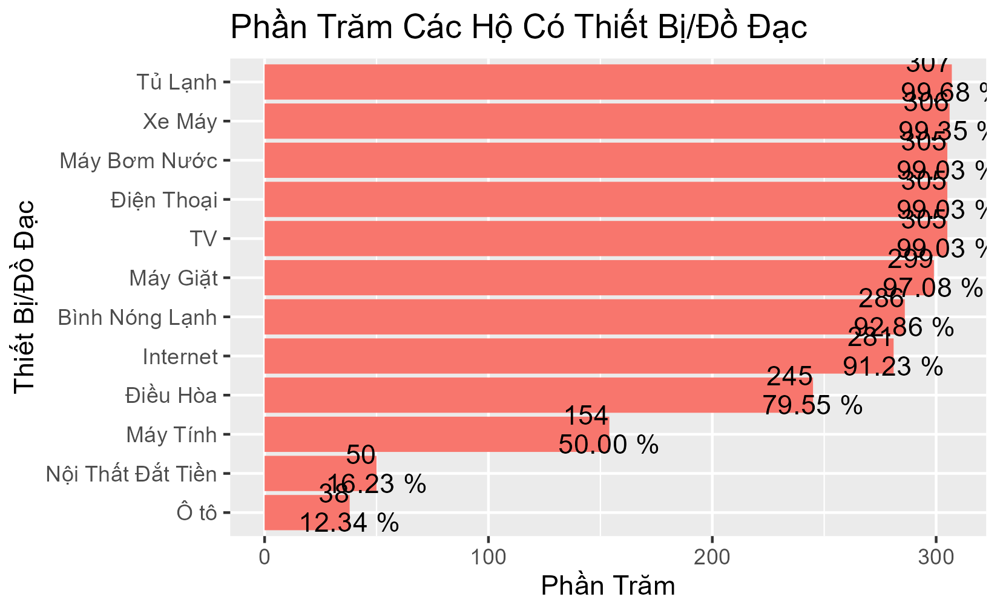
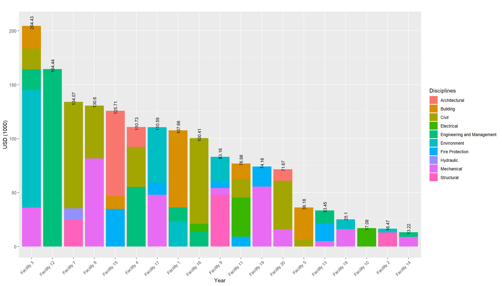
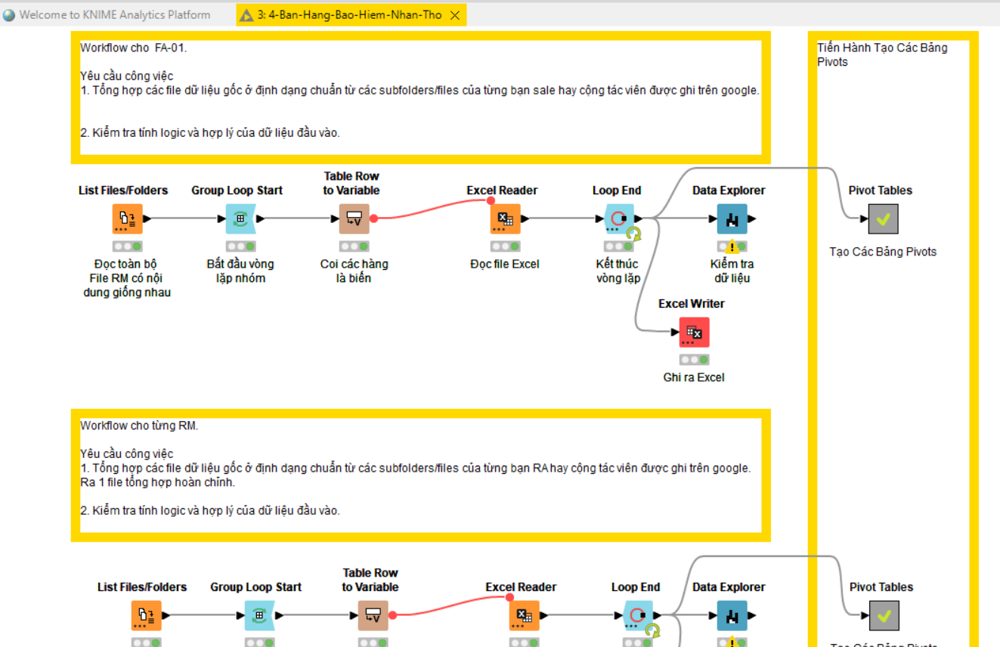
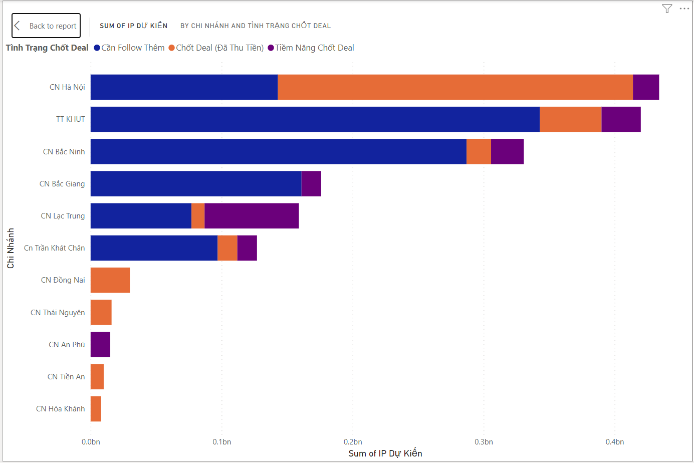

```{r setup, include=FALSE}
knitr::opts_chunk$set(echo = FALSE)
```


## Các Bước Trong Phân Tích Dữ Liệu


```{r, echo=FALSE, out.width="80%", fig.cap="", fig.align = 'center'}
knitr::include_graphics("assets/img/data-science-explore.png")
```


## Ví Dụ 1: Biến Động Giá Nhà Theo Thời Gian


> "Chỉ Số Giá các loại nhà được tổng hợp cho từng khu vực và theo từng năm. Giá nhà biến động theo thời gian do ảnh hưởng của các yêu tố như chính sách, di chuyển dân cư, và tình hình phát triển kinh tế xã hội. Việc thiết lập cơ sở dữ liệu để lưu trữ lại chỉ số biến động giá nhà và các biến đi kèm với nó cần được thực hiện có hệ thống. Ở các nước phát triển, hệ thống cơ sở dữ liệu này được chỉa sẻ trực tiếp từ trang web của các tổ chức chính phủ."
>


```{r, echo=FALSE, out.width="40%", fig.cap="", fig.align = 'center'}
knitr::include_graphics("assets/img/NHPI_plot.png")
```

https://tradingeconomics.com/canada/housing-index

https://www150.statcan.gc.ca/n1/pub/62f0014m/62f0014m2022003-eng.htm


## Ví Dụ 2: Vệ Sinh và An Toàn trong Cộng Đồng Dân Cư (WASH)

> "Các tổ chức tài chính như Ngân Hàng Thế Giới, Ngân Hàng Châu Á, Quĩ IFC, trước khi ra các quyết định liên quan đến đầu tư cơ sở hạ tầng để phục vụ phát triển an sinh xã hội. Họ thường yêu cầu lập các báo cáo nghiên cứu tiền khả thi và khả thi. Các báo cáo này gồm nhiều cấu phần và một trong những cấu phần là liên quan đến thực trạng của môi trường sống. Ví dụ để xây dựng một nhà máy sản xuất nước ở một số xã ở vùng ven đô thị và vùng nông thôn của Việt Nam, IFC và các tổ chức tài chính nước ngoài thường yêu cầu thực hiện WASH, tức là điều tra và đánh giá về vệ sinh và an toàn của các hộ dân sinh sống trong khu vực ảnh hưởng của dự án."
>


<div class='left' style='float:left;width:48%'>


```{r, echo=FALSE, out.width="90%", fig.cap="", fig.align = 'center'}

```

</div>

<div class='right' style='float:right;width:48%'>

```{r, echo=FALSE, out.width="90%", fig.cap="", fig.align = 'center'}
knitr::include_graphics("assets/img/graph_a7q5.png")
```

</div>


## Ví Dụ 3: Đánh Giá và Kiểm Định Công Trình ở Qui Mô Chiến Lược

> "Trước khi ra quyết định đầu tư liên quan đến mua bán và xát nhập công ty hay các công trình và hệ thống kĩ thuật. Chủ đầu tư thường thuê đơn vị tư vấn độc lập tiến hành khảo sát để đánh giá và kiểm định công trình ở mức độ chiến lược, việc đánh giá này thường được thực hiện trong một thời gian từ 2 đến 4 tuần, tùy vào mức độ qui mô của công trình. Để thực hiện được công việc này một cách bài bản, cần phát triển hệ thống ghi chép dữ liệu chặt chẽ ngay từ đầu."
>


<div class='left' style='float:left;width:48%'>


```{r, echo=FALSE, out.width="90%", fig.cap="", fig.align = 'center'}
knitr::include_graphics("assets/img/cooling.png")
```

</div>


<div class='right' style='float:right;width:48%'>

```{r, echo=FALSE, out.width="90%", fig.cap="", fig.align = 'center'}

```

</div>

## Ví Dụ 4: Bảo Hiểm Nhân Thọ

> "Khi bạn là một nhà quản lý và có một số đội ở dưới thì lúc đó bạn cần nắm bắt nhanh nhất có thể thông tin và báo cáo của các tổ trưởng các đội, và thậm chí là thông tin và báo cáo của từng người trong các tổ đội đó. Đây là một ví dụ cụ thể về việc tổng hợp thông tin liên quan đến bán bảo hiểm nhân thọ của một Công Ty Bảo Hiểm quốc tế, có trụ sở tại Việt Nam."
>


<div class='left' style='float:left;width:48%'>


```{r, echo=FALSE, out.width="90%", fig.cap="", fig.align = 'center'}

```

</div>

<div class='right' style='float:right;width:48%'>

```{r, echo=FALSE, out.width="90%", fig.cap="", fig.align = 'center'}

```

</div>


## Ví Dụ 5: Quản Lý Dự Án.

> "Khi tham gia vào một dự án, các nhà quản lý thường quan tâm đến tiến độ thực hiện dự án, tiến độ dự án không những về thời gian mà còn về khối lượng, hay đơn giản gọi là **tiến độ Giải Ngân**. Tiến độ này liên quan chặt chẽ tới thời gian và khối lượng công việc hoàn thành. Để nắm bắt được tiến độ này chính xác, bạn cần phải sử dụng các kiến thức liên quan đến EVM (Earned Value Management), mà để làm được việc này theo từng tuần, thậm chí là từng ngày thì bạn lại cần đến số liệu thu thập được từ từng cấu phần của dự án cho đến thời điểm hiện tại."
>


```{r, echo=FALSE, out.width="50%", fig.cap="", fig.align = 'center'}
knitr::include_graphics("assets/img/evm.png")
```


## Ví Dụ 6: Thiết Kế Biển Bản Cuộc Họp Như Thế Nào Cho Tối Ưu Nhất.

> "Việc viết biên bản cuộc họp là rất mất thời gian và đôi khi là mang nhiều tính rủi do liên quan đến câu chữ. Trong một tổ chức hay 1 dự án, có rất nhiều cuộc họp diễn ra và đôi khi bạn sẽ nhận thấy là các điểm nội dung của rất nhiều cuộc họp là giống nhau, và lặp đi lặp lại. Vậy chẳng nhẽ, mỗi lần như vậy, bạn cứ phải viết đi viết lại??? Bạn có muốn các biển bản cuộc họp được ghi chép một cách hệ thống để tiện cho công tác truy cứu và quản lý không?."
>


```{r, echo=FALSE, out.width="70%", fig.cap="", fig.align = 'center'}
knitr::include_graphics("assets/img/mom.png")
```


## Ví Dụ 7: Bản Đồ Hóa Tình Hình Dịch Bệnh Covid-19.


```{r, echo=FALSE, out.width="80%", fig.cap="", fig.align = 'center'}
knitr::include_graphics("assets/img/covid-19.png")
```

## Các Bước Trong Phân Tích Dữ Liệu


```{r, echo=FALSE, out.width="80%", fig.cap="", fig.align = 'center'}
knitr::include_graphics("assets/img/data-science-explore.png")
```

