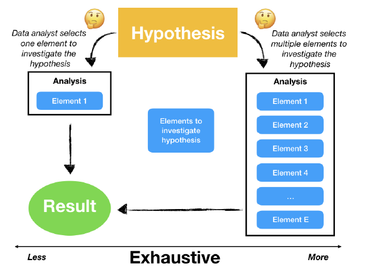
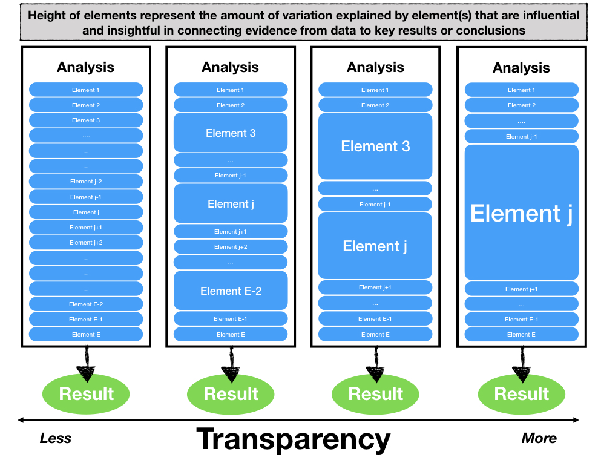

## Giới Thiệu

> Khoa học dữ liệu là khoa học và việc thiết kế của (1) liên tục tạo ra một câu hỏi để điều tra một giả định với dữ liệu, (2) thiết lập và kết nối câu hỏi đó với việc thu thập các dữ liệu liên quan và ứng dụng các phương pháp phù hợp, và (3) liên kết và ra quyết định dựa vào các kiến thức đã có hoặc kiến thức mới có được từ việc phân tích dữ liệu.

>
> `r tufte::quote_footer('--- Stephanie C. Hicks and Roger D. Peng, 2019')`

> Phân tích dữ liệu là một quá trình điều tra tìm hiểm để lấy ra các kiến thức, thông tin, và các nội dung của hiện thực.


>
> `r tufte::quote_footer('--- Grolemund and Wickham, 2014')`

- [50 năm ngành khoa học dữ liệu](http://courses.csail.mit.edu/18.337/2015/docs/50YearsDataScience.pdf)

- [Khoa học dữ liệu: Một rạp xiếc có 3 vòng hay là một cái lều lớn?](https://arxiv.org/ftp/arxiv/papers/1712/1712.07349.pdf)

- [Các Yếu Tố Cơ Bản và Nguyên Lý của Phân Tích Dữ Liệu](https://arxiv.org/pdf/1903.07639v1.pdf)

- [Khoa Học Dữ Liệu Giờ Đây Đã Khác Biệt](http://veekaybee.github.io/2019/02/13/data-science-is-different/)

## Giới Thiệu - Các Yếu Tố của Phân Tích Dữ Liệu

> Các Yếu Tố của phân tích dữ liệu là các Thành Phần cơ bản được nhà phân tích dùng như: Đoạn mã, ghi chú cho đoạn mã, trực quan hóa dữ liệu, các dòng viết diễn tả, các bản thống kê, các mô hình thống kê hay các thuật toán dùng để tính toán.

>
> `r tufte::quote_footer('--- Breiman, 2001')`

```{r echo=FALSE, message=FALSE,,warning=FALSE}
library(readxl)
library(dplyr)
# library(ggplot2)
data=read_excel("../data/introduction.xlsx",sheet="elementsofdata")
library(knitr)
library(kableExtra)
data %>%
  kbl() %>%
#  kable_classic(full_width = F, html_font = "Cambria")
  kable_paper(bootstrap_options = "striped", full_width = F,font_size = 22)
#kable(data, booktabs = TRUE)
```


## Các Nguyên Lý của Phân Tích Dữ Liệu - Công Việc Khớp Dữ Liệu

<div class='left' style='float:left;width:48%'>

 - Các dữ liệu có tính kết nối và tính khớp nhau cao sẽ giúp nhà phân tích xem xét các giả định và các vấn đề tốt hơn là việc xem xét các dữ liệu dời dạc và không khớp.
 

- Công việc khớp dữ liệu (đôi khi được biết đến là việc ghi hay liên kết dữ liệu, định danh...) là một tác vụ liên quan đến xác định, khớp nhau, kết nối các bảng ghi có cùng chung các thuộc tính từ các bảng dữ liệu khác nhau trong một hệ thống cơ sở dữ liệu.


</div>
<div class='left' style='float:left;width:48%'>


```{r, echo=FALSE, out.width="100%", fig.cap="", fig.align = 'center'}
knitr::include_graphics("assets/img/datamatching.png")
```
</div>


## Các Nguyên Lý của Phân Tích Dữ Liệu - Tính Toàn Diện

<div class='left' style='float:left;width:48%'>

- Một phân tích được cho là toàn diện nếu các câu hỏi cụ thể hay các giả định được đề cập sử dụng nhiều thành phần bổ sung.

- Việc kết hợp nhiều thành phần có thể đưa ra một bức tranh toàn diện liên quan đến chứng cứ trong dữ liệu hơn là việc sử dụng chỉ một thành phần. 


```{r, echo=FALSE, out.width="100%", fig.cap="", fig.align = 'center'}
knitr::include_graphics("assets/img/dataexhausive.png")
```

</div>
<div class='left' style='float:left;width:48%'>

```{r, echo=FALSE, out.width="100%", fig.cap="", fig.align = 'center'}

```

</div>

## Các Nguyên Lý của Phân Tích Dữ Liệu - Tính Hoài Nghi

- Một phân tích có tính hoài nghi nếu nhiều giả định hoặc nhiều giải thích của một hiện tượng được quan sát là được xem xét khi sử dụng cùng nguồn dữ liệu và đưa ra được tính kiên định trong dữ liệu với các giải thích khác. Trái ngược lại, các phân tích mà không tính đến lời giải thích khác thì được coi là không có tính hoài nghi.


```{r, echo=FALSE, out.width="50%", fig.cap="", fig.align = 'center'}
knitr::include_graphics("assets/img/data-skeptical01.png")
```

## Các Nguyên Lý của Phân Tích Dữ Liệu - Bậc 2


- Một phân tích được coi có tính chất bậc 2 nếu nó bao gồm các thành phần khác mà không trực tiếp đề cập đến giải định/câu hỏi ban đầu, nhưng lại có thể đưa/chỉ ra được bối cảnh quan trọng của việc phân tích.


```{r, echo=FALSE, out.width="40%", fig.cap="", fig.align = 'center'}
knitr::include_graphics("assets/img/data-2ndorder.png")
```

## Các Nguyên Lý của Phân Tích Dữ Liệu - Sự Minh Bạch

<div class='left' style='float:left;width:48%'>

- Các phân tích có tính minh bạch thể hiện một yếu cố hay nhiều yêu tố thống kê lại/ hoặc trực quan hóa các dữ liệu có tính ảnh hưởng đến việc giải thích như thế nào mà các hiện tượng hay quá trình tạo ra dữ liệu kết nối với kết quả đầu ra hay các kết luận.

- Trong khi toàn bộ việc phân tích có thể là phức tạp và liên quan đến nhiều bước tính toán rất dài, các phân tích có tính minh bạch lấy ra một hoặc vài thành tố có thể giải thích được tính biến đổi nhiều nhất hay ảnh hưởng nhất tới việc hiểu biết các kết quả hay các kết luận.


</div>
<div class='left' style='float:left;width:48%'>

```{r, echo=FALSE, out.width="100%", fig.cap="", fig.align = 'center'}

```

</div>


## Các Nguyên Lý của Phân Tích Dữ Liệu - Có Tính Sao Chép Lại

<div class='left' style='float:left;width:48%'>

- Một phân tích là có tính sao chép nếu một người nào đó không phải là người phân tích ban đầu có thể sử dụng phân tích đó dễ dàng và tạo ra kết quả như nhau, giống với kết quả mà người phân tích ban đầu tạo ra.

- Vấn đề quan trọng của việc sao chép là khả năng có thể dùng được của cầu phần phân tích đối với người khác. 

- Tính sao chép là quan trọng trong ngữ cảnh cùng làm việc theo Luồng công việc (Workflow).


</div>
<div class='left' style='float:left;width:48%'>

```{r, echo=FALSE, out.width="100%", fig.cap="", fig.align = 'center'}
knitr::include_graphics("assets/img/data-reproducible.png")
```


</div>


<!-- ## Các Nguyên Lý của Phân Tích Dữ Liệu - Tính Nguyên Tử -->

<!-- <div class='left' style='float:left;width:48%'> -->

<!-- - the data analyst first chooses a principle to investigate a hypothes is -->
<!-- or scientific question (Stage A).  -->

<!-- - the analyst alternates between Stages B and C until the analyst exits the atomic unit, either by choosing to end the line of investigation or choosing to invoke a new principle. -->

<!-- </div> -->
<!-- <div class='left' style='float:left;width:48%'> -->

<!-- ```{r, echo=FALSE, out.width="100%", fig.cap="", fig.align = 'center'} -->
<!-- knitr::include_graphics("assets/img/data-atomic.png") -->
<!-- ``` -->


<!-- </div> -->

<!-- ## Hiểu Rõ Dữ Liệu của Bạn (1) -->

<!-- **[Nền Tảng về Phân Tích Dữ Liệu: Hiểu Dữ Liệu Của Bạn. Phải Thật Sự, Thật Sự Hiểu Nó](https://towardsdatascience.com/data-science-foundations-know-your-data-really-really-know-it-a6bb97eb991c).** -->

<!-- > Bạn đồng nghiệp trong công ty, mặc dù họ không có chuyên môn về dữ liệu, nhưng họ là chuyên gia về lĩnh vực chuyên môn của họ. Nên nếu bạn là một nhà phân tích dữ liệu còn non trẻ, bạn không nên  -->

<!-- Your colleagues in business, despite not being data people, aren’t idiots of any sort (hopefully). They’re domain experts that know tons about the business. Don’t be the junior analyst presenting a brilliant new finding to the CEO that gets asked "so did you take out the 3 special high volume contract accounts we have?”, doesn’t end well. -->

<!-- ```{r, echo=FALSE, out.width="80%", fig.cap="", fig.align = 'center'} -->
<!-- url <- "https://miro.medium.com/max/875/1*MmmBLiC7GACdZWwZFykoqQ.png" -->
<!-- knitr::include_graphics(url) -->
<!-- #knitr::include_graphics("../Visual/data-atomic.png") -->
<!-- ``` -->


## Hiểu Dữ Liệu của Bạn

<div class='left' style='float:left;width:48%'>

- Hiểu về cấu trúc dữ liệu
- Hiểu về việc ghi dữ liệu
- Hiểu về các thói quen trong kinh doanh
- Hiểu dữ liệu từ đâu tới, nó được hình thành như thế nào
- Hiểu về các quyết định liên quan đến thu thập

<span style="color: red;"> Bạn không bao giờ có được bộ dữ liệu hoàn hảo hay hiểu được rõ ràng về toàn bộ dữ liệu bạn hiện có. Bởi vì, chỉ khi bạn đã nắm bắt và hiểu rõ về một điều gì đó, thì sẽ có những thuộc tính mới được thêm vào, thay đổi về tiêu chuẩn, hay hệ thông bị lỗi thời. Do đó, bạn nên **Tiếp Tục Học**, ghi lại nhưng điều cần thiết, để lại dấu tích để bạn có thể quay lại với công việc mà không mất thêm quá nhiều thời gian.</span>


</div>
<div class='left' style='float:left;width:48%'>


```{r, echo=FALSE, out.width="100%", fig.cap="", fig.align = 'center'}
url <- "https://miro.medium.com/max/865/1*X1n4WeN_cWohvxRkeVCPMQ.png"
knitr::include_graphics(url)
#knitr::include_graphics("../Visual/data-atomic.png")
```

</div>


## Khuynh Hướng Sai của Dữ Liệu

<div class='left' style='float:left;width:48%'>

[Caroline Criado-Perez On Data Bias And 'Invisible Women'](https://www.npr.org/2019/03/17/704209639/caroline-criado-perez-on-data-bias-and-invisible-women)


<iframe src="https://www.npr.org/player/embed/704209639/704209640" width="90%" height="180" frameborder="0" scrolling="no" title="NPR embedded audio player"></iframe>


<div class='left' style='float:left;width:48%'>
```{r, echo=FALSE, out.width="100%", fig.cap="", fig.align = 'center'}
url <- "https://i.gr-assets.com/images/S/compressed.photo.goodreads.com/books/1617113740i/41104077._UY473_SS473_.jpg"
knitr::include_graphics(url)
```
</div>
<div class='left' style='float:left;width:48%'>
```{r, echo=FALSE, out.width="68%", fig.cap="", fig.align = 'center'}
url <- "https://api.time.com/wp-content/uploads/2016/08/weapons-of-math-destruction.jpeg"
knitr::include_graphics(url)
```
</div>

</div>
<div class='left' style='float:left;width:48%'>

```{r, echo=FALSE, out.width="90%", fig.cap="", fig.align = 'center'}
url <- "https://productiveclub.com/wp-content/uploads/2020/07/sampling-bias.jpeg"
knitr::include_graphics(url)
```
</div>


