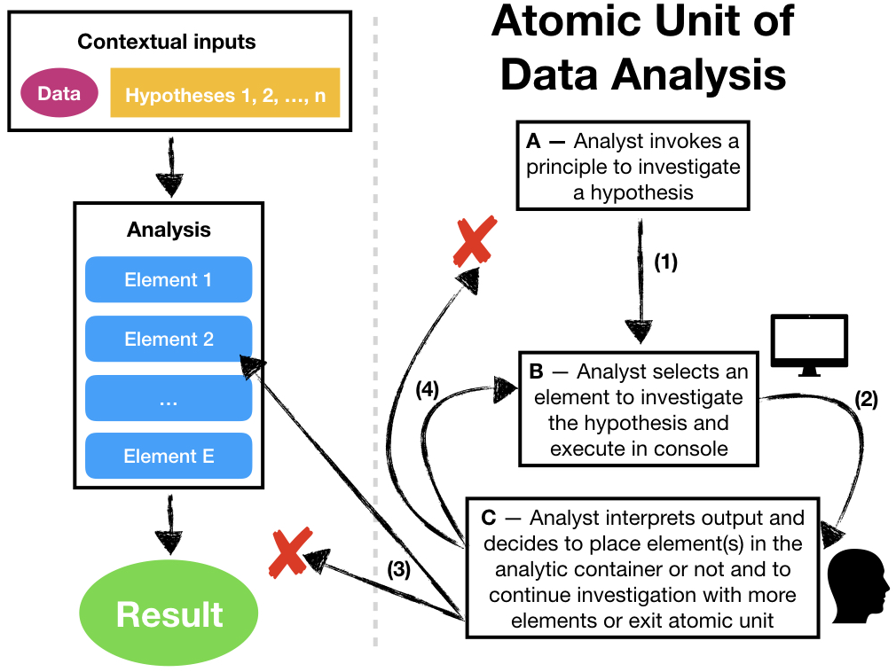

## Làm Sạch và Xác Thực Dữ Liệu (1)

> Làm sạch dữ liệu là một quá trình phát hiện, sửa, loại bỏ, thay đổi các dòng dữ liệu không chính xác/ bị lỗi từ các bảng ghi, các cơ sở dữ liệu.  Công việc làm sạch có thể được tiến hành bởi các công cụ chuyên dụng, hoặc có thể được làm theo lô thông qua dòng lệnh.

>
> `r tufte::quote_footer('--- https://en.wikipedia.org/wiki/Data_cleansing')`

<span style="color: red;"> Các nhà khoa học dữ liệu sử dụng **60% thời gian của họ để làm sạch ** và thiết lập dữ liệu. Thu thập dữ liệu chiếm khoảng 19% thời gian, điều này có nghĩa là khoảng **80% thời gian của họ là dành cho việc chuẩn bị và quản lý dữ liệu**.</span>


> Xác thực dữ liệu là một hoạt động nhằm xác thực một tập hợp các giá trị là một thành viên của các tập hợp được chấp nhận.
>
> `r tufte::quote_footer('--- [Zio et al. 2016](https://ec.europa.eu/eurostat/cros/system/files/methodology_for_data_validation_v1.0_rev-2016-06_final.pdf)')`


## Làm Sạch và Xác Thực Dữ Liệu (2)


<div class='left' style='float:left;width:48%'>

```{r, echo=FALSE, out.width="100%", fig.cap="", fig.align = 'center'}
knitr::include_graphics("assets/img/data-validationprocess.png")
```

Source: [Phương Pháp Xác Thực Dữ Liệu 1.0](https://ec.europa.eu/eurostat/cros/system/files/methodology_for_data_validation_v1.0_rev-2016-06_final.pdf)

</div>

<div class='right' style='float:right;width:48%'>

- Xác Thực Cấp Độ 0: Tính nhất quán với các yêu cầu về cấu trúc IT
- Xác Thực Cấp Độ 1: Tính nhất quán trong chính gói dữ liệu
- Xác Thực Cấp Độ 2: Tính nhất quán với các gói dữ liệu trong cùng một miền và trong cùng một nguồn dữ liệu
- Xác Thực Cấp Độ 3:  Tính nhất quán trong cùng một miền với các nguồn dữ liệu khác nhau
- Xác Thực Cấp Độ 4:  Tính nhất quán giữa các miền tách biệt trong cùng một nhà cung cấp
- Xác Thực Cấp Độ 5: Tính nhất quán với dữ liệu của các nhà cung cấp.

</div>

## Dữ Liệu Gọn Gàng - Cấu Trúc

<div class='left' style='float:left;width:48%'>

**Không Gọn Gàng**

Thể hiện điển hình

```{r echo=FALSE, message=FALSE,warning=FALSE}
library(readxl)
library(dplyr)
# library(ggplot2)
data=read_excel("../data/tidydata.xlsx",sheet="treatment01")
library(knitr)
library(kableExtra)
options(knitr.kable.NA = '')
data %>%
  kbl() %>%
#  kable_classic(full_width = F, html_font = "Cambria")
  kable_paper(bootstrap_options = "striped", full_width = F,font_size = 22)
#kable(data, booktabs = TRUE)
```

Thể Hiện Điển Hình (Tiếp)


```{r echo=FALSE, message=FALSE,warning=FALSE}
# library(ggplot2)
data=read_excel("../data/tidydata.xlsx",sheet="treatment02")
data %>%
  kbl() %>%
#  kable_classic(full_width = F, html_font = "Cambria")
  kable_paper(bootstrap_options = "striped", full_width = F,font_size = 22)
#kable(data, booktabs = TRUE)
```

- Cái gì là <span style="color: red;">**Biến**</span>, <span style="color: red;">**Quan sát**</span>, <span style="color: red;">**Giá trị**</span>?

</div>


<div class='right' style='float:right;width:48%'>
> Các gia đình hạnh phúc thì đều giống nhau, các gia đình không hạnh phúc thì không hạnh phúc theo từng cách riêng của họ

>
> `r tufte::quote_footer('--- Leo Tolstoy')`

Như là các gia đình, các dữ liệu gọn gàng thì đều giống nhau, nhưng các dữ liệu lộn xộn, không gọn gàng thì lộn xộn theo từng cách riêng của nó và không giống nhau. Các gói dữ liệu gọn gàng cung cấp một cách tiêu chuẩn để kết nối cấu trúc của một tập dữ liệu (theo sơ đồ vật lý) và với nghữ nghĩa của nó (nghĩa). 


```{r, echo=FALSE, out.width="60%", fig.cap="", fig.align = 'center'}

```

</div>


## Dữ Liệu Gọn Gàng - Định Nghĩa

<div class='left' style='float:left;width:48%'>

Một gói dữ liệu là một tập hợp các giá trị, thường ở dạng số hay dạng chữ. Các giá trị này được thiết lập theo 2 cách. Toàn bộ các giá trị thuộc về một **Biến** và một **Quan Sát**. Một biến chứa đựng trong nó toàn bộ các giá trị để đo lường cho cùng một thuộc tính (như chiều cao, nhiệt độ, thời gian) trên các đơn vị. Một Quan Sát chứa toàn bộ các giá trị được đo lường trên cùng một đơn vị (như một người, một ngày, một chủng tộng) trên các thuộc tính.


```{r, echo=FALSE, out.width="90%", fig.cap="", fig.align = 'center'}
knitr::include_graphics("assets/img/tidydata_2.jpg")
```

Nguồn: [Openscapes](https://www.openscapes.org/blog/2020/10/12/tidy-data/)
</div>

<div class='right' style='float:right;width:48%'>

** Dữ liệu gọn gàng là một cách tiêu chuẩn của công việc chuyển thể (bản đồ hóa) ý nghĩa của một gói dữ liệu tới cấu trúc của nó. Một gói dữ liệu là lộn xộn hay gọn gàng phụ thuộc vào việc các dòng, các cột và các bảng của chúng có tương tích với các quan sát, các biến, và loại dữ liệu như thế nào**. Trong một dữ liệu gọn gàng thì:


  - Mỗi một biến cấu thành một cột.
  - Mỗi một quan sát cấu thành một hàng.
  - Mỗi một loại đơn vị quan sát cấu thành một bảng.

```{r echo=FALSE, message=FALSE,warning=FALSE}
# library(ggplot2)
data=read_excel("../data/tidydata.xlsx",sheet="treatment03")
data %>%
  kbl() %>%
#  kable_classic(full_width = F, html_font = "Cambria")
  kable_paper(bootstrap_options = "striped", full_width = F,font_size = 22)
#kable(data, booktabs = TRUE)
```

</div>


## Dữ Liệu Gọn Gàng - Dọn Dẹp Phòng Của Bạn theo Cách của Chuyên Gia Marie Kondo (KONMARI)

<div class='left' style='float:left;width:48%'>

```{r, echo=FALSE, out.width="60%", fig.cap="", fig.align = 'center'}
url <- "https://kenh14cdn.com/thumb_w/620/2019/1/30/artboard-1-copy-3-1548865803939988101634.jpg"
knitr::include_graphics(url)
#
```

[Phương pháp Marie Kondo: Nghệ thuật dọn dẹp nhà cửa](https://www.btaskee.com/kinh-nghiem-hay/don-dep-nha-voi-phuong-phap-marie-kondo/)

</div>

<div class='right' style='float:right;width:48%'>

Gấp Đồ Lót Trong Tủ Quần Áo


<iframe width="560" height="315" src="https://www.youtube.com/embed/tglp9eWQEhY" title="YouTube video player" frameborder="0" allow="accelerometer; autoplay; clipboard-write; encrypted-media; gyroscope; picture-in-picture" allowfullscreen></iframe>


Thiết Kế Cuộc Sống Để Luôn Vui Vẻ


<iframe width="560" height="315" src="https://www.youtube.com/embed/rAC4sprfqgU" title="YouTube video player" frameborder="0" allow="accelerometer; autoplay; clipboard-write; encrypted-media; gyroscope; picture-in-picture" allowfullscreen></iframe>


</div>


## Dọn Dẹp Dữ Liệu Lộn Xộn (1)

<div class='left' style='float:left;width:48%'>

- Tên các cột là giá trị, không phải là Biến
- Nhiều biến được ghi trong một cột

- Các biến được lưu ở cả hàng và cột

- Các loại dữ liệu của nhiều đối tượng quan sát được ghi trong cùng một bảng

- Một đối tượng quan sát được ghi ở nhiều bảng

</div>

<div class='left' style='float:left;width:48%'>
```{r, echo=FALSE, out.width="90%", fig.cap="", fig.align = 'center'}
url = "https://www.openscapes.org/img/blog/tidydata/tidydata_3.jpg"
knitr::include_graphics(url)
```
source: [Openscapes](https://www.openscapes.org/blog/2020/10/12/tidy-data/)

</div>


## Column headers are values, not variable names (1)


<div class='left' style='float:left;width:48%'>

Messy Data


```{r echo=FALSE, message=FALSE,warning=FALSE}
source("../Code/pew-tidying.R")
#library(dplyr)
#library(reshape2)
#df=read.csv("../Data/tidy-data/data/pew-raw.csv", sep=",", header=TRUE)
</div>
