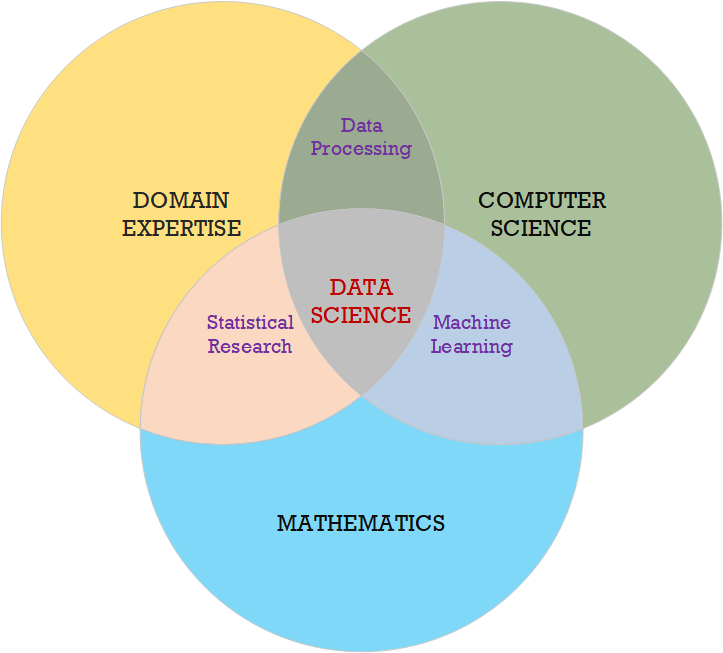
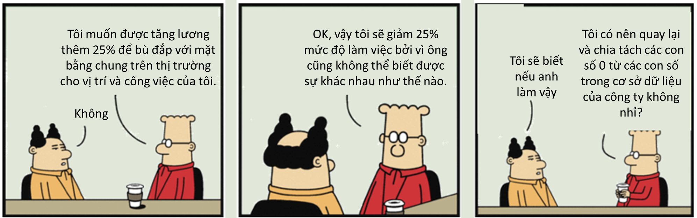

```{r setup, include=FALSE}
knitr::opts_chunk$set(echo = FALSE)
```

## About Me


<div class='left' style='float:left;width:48%'>
- Bio
  - My main major is quantitative risk analysis and asset management for buildings and engineering systems. Data analytics work is one of my interest.
  - 4 years lived in Japan (Doctoral Study at Kyoto University and postdoc at Osaka University) 
  - <2 years in Thailand (Master Study 2002-2004) 
  - 6 years in Switzerland (2010-2016, ETH Zurich) 
  - 6 years in the Philippines (2016-2021) 
  - Currently living in several locations Vietnam, Philippines, and India.
 

- Sports
  - Long distance running `r emo::ji("running")``r emo::ji("running")``r emo::ji("running_man")`
  - Diving `r emo::ji("swimming_man")`
  - and some others ^_^ `r emo::ji("smile")``r emo::ji("smiling_imp")`

</div>
<div class='right' style='float:right;width:48%'>

```{r attr.source="style='display:inline-block;'", collapse=TRUE, echo = FALSE, message=FALSE,warning=FALSE}
source("../code/bio.R")
p
```
</div>


### About Me

<div class='left' style='float:left;width:48%'>

```{r attr.source="style='display:inline-block;'", collapse=TRUE, echo = FALSE, message=FALSE,warning=FALSE}
source("../code/bio.R")
q
```

</div>
<div class='right' style='float:right;width:48%'>

```{r attr.source="style='display:inline-block;'", collapse=TRUE, echo = FALSE, message=FALSE,warning=FALSE}
source("../code/bio.R")
ggplotly(w)
```
</div>


## About YOU

```{r, echo=FALSE, out.width="80%", fig.cap="", fig.align = 'center',collapse=TRUE, echo = FALSE, message=FALSE,warning=FALSE}
library(DT)
library(tidyverse)
library(readxl) 
library(lubridate)
df=read_excel("../data/students.xlsx",sheet="student",skip = 0)
df$`Ngày sinh` <- as.Date(df$`Ngày sinh`,format = "%d/%m/%y")
p <- datatable(df,rownames = FALSE, filter = 'top',
          options = list(pageLength = 10,autoWidth = TRUE)
          )
p
```

## Voting for our Class Monitor
<div class='left' style='float:left;width:50%'>
```{r, echo=FALSE, out.width="95%", fig.cap="", fig.align = 'center'}

```

</div>

<div class='left' style='float:left;width:50%'>

```{r, echo=FALSE, out.width="95%", fig.cap="", fig.align = 'center'}
knitr::include_graphics("assets/img/classmember-02.png")
```

</div>

### Random voting
```r
# Selecting a Monitor for our Class.
library(purrr)
# reading data file
library(readxl) 
library(dplyr)
library(ggChernoff)
df=read_excel("../Data/students.xlsx",sheet="student",skip = 0)

l <- length(df$Stt)

df1 <- replicate(sample(1:l, 1, replace = FALSE), n = 10000)
df1 <- data.frame(df1)
df2 <- data.frame(table(df1))
which.max(df2$Freq)


df4 <- df %>%
  select(c(1,2,3,5,7,13,14)) %>%
  mutate(freq = df2$Freq) 

names(df4) <- c('ID', 'lastname', 'firstname', 'age', 'sex', 'field', 'fullname', 'freq')

df4 <- data.frame(df4)

library(ggplot2)

ggplot(df4) +
  aes(age, freq, fill = field) +
  geom_chernoff()+
  labs(y = "Số phiếu bầu", x ="Độ Tuổi")+ 
  geom_text(aes(label=paste(lastname,firstname)), position=position_dodge(width=1), vjust=2, cex =2.5)


ggplot(df4) +
  aes(age, freq, fill = sex) +
  geom_chernoff()+
  labs(y = "Số phiếu bầu", x ="Độ Tuổi")+ 
  geom_text(aes(label=paste(lastname,firstname)), position=position_dodge(width=1), vjust=2, cex =2.5)

summary(df4$age)

cat(" Chúc mừng bạn", paste(df$'Họ'[which.max(df2$Freq)]), paste(df$'Tên'[which.max(df2$Freq)]))
```


## About the Course (1) - the Venn Diagram


```{r, echo=FALSE, out.width="40%", fig.cap="", fig.align = 'center'}

```

## About the Course (2) - Data Science vs Data Analytics

```{r, echo=FALSE, out.width="80%", fig.cap="", fig.align = 'center'}
knitr::include_graphics("assets/img/datascience-venn-02.png")
```


## About the Course (3) - Data Science vs Data Analytics


<div class='left' style='float:left;width:30%'>
- Some basic statistical methods and computing
- Data and Tidy data
- Basic data management system
- Basic programming with R
- Data analytics tools
- Data visualization
- Data storytelling
</div>

<div class='left' style='float:left;width:60%'>
```{r, echo=FALSE, out.width="100%", fig.cap="", fig.align = 'center'}
knitr::include_graphics("assets/img/Data-Engineer-vs-Data-Scientist-vs-Data-Analyst.png")
```
</div>


## What are the benefits?


<div class='left' style='float:left;width:48%'>

```{r, echo=FALSE, out.width="80%", fig.cap="", fig.align = 'center'}
knitr::include_graphics("assets/img/before-after-trump-un.png")
```

```{r, echo=FALSE, out.width="80%", fig.cap="", fig.align = 'center'}

```

</div>

<div class='right' style='float:right;width:48%'>

**You do not need to become a data scientist, but you can be knowledgeable and capable with data analytic works**

- Collecting data and recording it properly
- The difference and purpose of different database management systems
- Automation and reproduction
- Increase the level of efficiency and productivity
- Transformation
</div>


## Course Program and Schedule


```{r, echo=FALSE, out.width="80%", fig.cap="", fig.align = 'center',collapse=TRUE, echo = FALSE, message=FALSE,warning=FALSE}
source("../code/schedule.R")
p
```


## References and Reading Materials


<div class='left' style='float:left;width:48%'>
- Books & Platforms
  - [R for Data Science](https://r4ds.had.co.nz/index.html)
  - [Elegant Graphics for Data Analysis](https://ggplot2-book.org/index.html)
  - [Github](https://github.com/)
  - [R Statistical Computing](https://www.r-project.org/) and  [Rstudio](https://www.rstudio.com/)
  - [R Graph Gallery](https://www.r-graph-gallery.com/)
  - [Plotly R Open Source Graphing Library](https://plotly.com/r/)
  - [Bookdown](https://bookdown.org/)s
  <!-- - [Stat545](https://stat545.com/index.html) -->
- R Packages
  - [Tidyverse](https://www.tidyverse.org/), [Dplyr](https://dplyr.tidyverse.org/), [Ggplot2](https://ggplot2.tidyverse.org/), [DT](https://rstudio.github.io/DT/),  [Rattle](https://rattle.togaware.com/)

- Repository and Data

  - Google Drive: https://bit.ly/3qWe6Fh
  - Github:       https://github.com/iscmueh/MS-DS001


</div>

<div class='left' style='float:left;width:48%'>

```{r, echo=FALSE, out.width="100%", fig.cap="", fig.align = 'center'}
knitr::include_graphics("assets/img/01_tidyverse_data_science.png")
```

</div>

## Expectations and Requirements

```{r, echo=FALSE, out.width="60%", fig.cap="", fig.align = 'center'}
library(ggplot2)

# Create test data.
data <- data.frame(
  category=c("Class participation", "Assignment", "Exam"),
 count=c(50, 20, 30)
)
 
# Compute percentages
data$fraction <- data$count / sum(data$count)

# Compute the cumulative percentages (top of each rectangle)
data$ymax <- cumsum(data$fraction)

# Compute the bottom of each rectangle
data$ymin <- c(0, head(data$ymax, n=-1))

# Compute label position
data$labelPosition <- (data$ymax + data$ymin) / 2

# Compute a good label
data$label <- paste0(data$category, "\n value: ", data$count)

# Make the plot
ggplot(data, aes(ymax=ymax, ymin=ymin, xmax=4, xmin=3, fill=category)) +
  geom_rect() +
  geom_label( x=3.5, aes(y=labelPosition, label=label), size=6) +
  scale_fill_brewer(palette=4) +
  coord_polar(theta="y") +
  xlim(c(2, 4)) +
  theme_void() +
  theme(legend.position = "none")
```

## A Brief on R Statistical Computing Program

<div class='left' style='float:left;width:48%'>
<div class='left' style='float:left;width:48%'>
[Robert Gentleman](https://computationalbiomed.hms.harvard.edu/people/robert-gentleman)
```{r, echo=FALSE, out.width="80%", fig.cap="", fig.align = 'center'}
url <- "https://computationalbiomed.hms.harvard.edu/sites/g/files/mcu1016/files/profile-photos/Robert-Gentleman-200x240.png"
knitr::include_graphics(url)
#knitr::include_graphics("../Visual/data-atomic.png")
```
Harvard Medical School

</div>

<div class='left' style='float:left;width:48%'>
[Ross Ihaka](https://www.stat.auckland.ac.nz/~ihaka/)
```{r, echo=FALSE, out.width="65%", fig.cap="", fig.align = 'center'}
url <- "https://www.stat.auckland.ac.nz/~ihaka/images/ross-ihaka.jpg"
knitr::include_graphics(url)
#knitr::include_graphics("../Visual/data-atomic.png")
```
Professor of Statistics at the University of Auckland
</div>

- 1991 S implementation
- 1993 Published R Code
- 1995 Made R to be open source and FREE

</div>


<div class='left' style='float:left;width:48%'>

S language was developed in BELL Lab since 1976

```{r, echo=FALSE, out.width="100%", fig.cap="", fig.align = 'center'}
url <- "https://www.telecomreview.com/images/stories/2020/03/Nokia_Bell_Labs_achieves_world_record_in_fiber_optics-article.jpg"
knitr::include_graphics(url)
#knitr::include_graphics("../Visual/data-atomic.png")
```

- 9 Nobels Recipients
- AMPL Optimizer
- C Programing Language

</div>


## An Introduction to R (1)

<div class='left' style='float:left;width:30%'>

[An Introduction to R](https://intro2r.com/) by Alex Douglas, Deon Roos, Francesca Mancini, Ana Couto & David Lusseau

```{r, echo=FALSE, out.width="65%", fig.cap="", fig.align = 'center'}
url <- "https://intro2r.com/images/cover_v3.png"
knitr::include_graphics(url)
#knitr
```
</div>


<div class='left' style='float:left;width:65%'>
[Phân Tích Dữ Liệu với R](https://nguyenvantuan.info/publication/#jp-carousel-1489) - Giáo Sư [Nguyễn Văn Tuấn](https://nguyenvantuan.info/), University of Technology Sydney, Australia.

<div class='left' style='float:left;width:48%'>
```{r, echo=FALSE, out.width="70%", fig.cap="", fig.align = 'center'}
url <- "https://nguyenvantuan830970966.files.wordpress.com/2020/10/50879-86994c_3b7445736eab4e9d8863ca616c088736mv2.jpg?w=400&h=&zoom=2"
knitr::include_graphics(url)
#knitr
```
</div>

<div class='left' style='float:left;width:48%'>

<iframe width="560" height="315" src="https://www.youtube.com/embed/nUrR0t45gx4" title="YouTube video player" frameborder="0" allow="accelerometer; autoplay; clipboard-write; encrypted-media; gyroscope; picture-in-picture" allowfullscreen></iframe>

</div>

</div>


## An Introduction to R (2)

<div class='left' style='float:left;width:25%'>
- Working directory
- File name and structure
- File names
- Project documentation
- Data types
- Data structures
</div>

<div class='left' style='float:left;width:75%'>

```{r, echo=FALSE, out.width="95%", fig.cap="", fig.align = 'center', warning=FALSE}
library(knitr)
knitr::include_graphics("assets/img/rstudio.png")
```


</div>


## Data Structures (1)

<div class='left' style='float:left;width:48%'>

```{r, echo=FALSE, out.width="45%", fig.cap="", fig.align = 'center'}
url <- "https://intro2r.com/images/scal_vec.png"
knitr::include_graphics(url)
#knitr
```

```{r, echo=FALSE, out.width="70%", fig.cap="", fig.align = 'center'}
url <- "https://intro2r.com/images/mat_array.png"
knitr::include_graphics(url)
#knitr
```

</div>

<div class='left' style='float:left;width:48%'>
Matrix
```{r, echo=TRUE, include = TRUE,message=FALSE,warning=FALSE}
my_mat <- matrix(1:16, nrow = 4, byrow = TRUE)
my_mat
```

Array
```{r, echo=TRUE, include = TRUE,message=FALSE,warning=FALSE}
my_array <- array(1:16, dim = c(2, 4, 2))
my_array
```
</div>


## Data Structures (2)

<div class='left' style='float:left;width:45%'>
List
```{r, echo=TRUE, include = TRUE,message=FALSE,warning=FALSE}
list_1 <- list(c("black", "yellow", "orange"),
               c(TRUE, TRUE, FALSE, TRUE, FALSE, FALSE),
               matrix(1:6, nrow = 3))
list_1
```

</div>

<div class='left' style='float:left;width:45%'>
Data Frame
```{r, echo=TRUE, include = TRUE,message=FALSE,warning=FALSE}
p.height <- c(180, 155, 160, 167, 181)
p.weight <- c(65, 50, 52, 58, 70)
p.names <- c("Joanna", "Charlotte", "Helen", "Karen", "Amy")

dataf <- data.frame(height = p.height, weight = p.weight, names = p.names)
dataf
```

</div>


## Data Wrangling

```{r, echo=FALSE, out.width="80%", fig.cap="", fig.align = 'center'}
url <- "https://favtutor.com/resources/images/uploads/DATA_WRANGLING.jpg"
knitr::include_graphics(url)
#knitr
```


## Data Importing

<div class='left' style='float:left;width:45%'>
Common data files

- text/flat files
- cvs/excel files
- tables from databases

[Importing data into R](http://www.sthda.com/english/wiki/importing-data-into-r)

```{r, echo=FALSE, out.width="70%", fig.cap="", fig.align = 'center'}
url <- "http://www.sthda.com/sthda/RDoc/images/importing-data-into-r.png"
knitr::include_graphics(url)
#knitr
```


</div>


<div class='left' style='float:left;width:45%'>
R Packages and function


```r
# Read tab separated values
read.delim(file.choose())
# Read comma (",") separated values
read.csv(file.choose())
# Read semicolon (";") separated values
read.csv2(file.choose())
```

```r
library("readr")
# Read tab separated values
read_tsv(file.choose())
# Read comma (",") separated values
read_csv(file.choose())
# Read semicolon (";") separated values
read_csv2(file.choose())
```

```r
#reading sheet in an excel file
library(readxl) 
df=read_excel("../Data/introduction.xlsx",sheet="bio-time",skip = 0)
```


</div>

## Data Exporting


<div class='left' style='float:left;width:45%'>
Common data files

- text/flat files
- cvs/excel files
- tables from databases

[Exporting data from R](http://www.sthda.com/english/wiki/exporting-data-from-r)

```{r, echo=FALSE, out.width="70%", fig.cap="", fig.align = 'center'}
url <- "http://www.sthda.com/sthda/RDoc/images/exporting-data-from-r.png"
knitr::include_graphics(url)
#knitr
```


</div>


<div class='left' style='float:left;width:45%'>
R Packages and function


```r
# Loading mtcars data
data("mtcars")
# Write data to txt file: tab separated values
# sep = "\t"
write.table(mtcars, file = "mtcars.txt", sep = "\t",
            row.names = TRUE, col.names = NA)
# Write data to csv files:  
# decimal point = "." and value separators = comma (",")
write.csv(mtcars, file = "mtcars.csv")
# Write data to csv files: 
# decimal point = comma (",") and value separators = semicolon (";")
write.csv2(mtcars, file = "mtcars.csv")
```

```r
# Loading mtcars data
data("mtcars")
library("readr")
# Writing mtcars data to a tsv file
write_tsv(mtcars, path = "mtcars.txt")
# Writing mtcars data to a csv file
write_csv(mtcars, path = "mtcars.csv")
```

```r
library("xlsx")
# Write the first data set in a new workbook
write.xlsx(USArrests, file = "myworkbook.xlsx",
      sheetName = "USA-ARRESTS", append = FALSE)
# Add a second data set in a new worksheet
write.xlsx(mtcars, file = "myworkbook.xlsx", 
           sheetName="MTCARS", append=TRUE)
```

</div>


