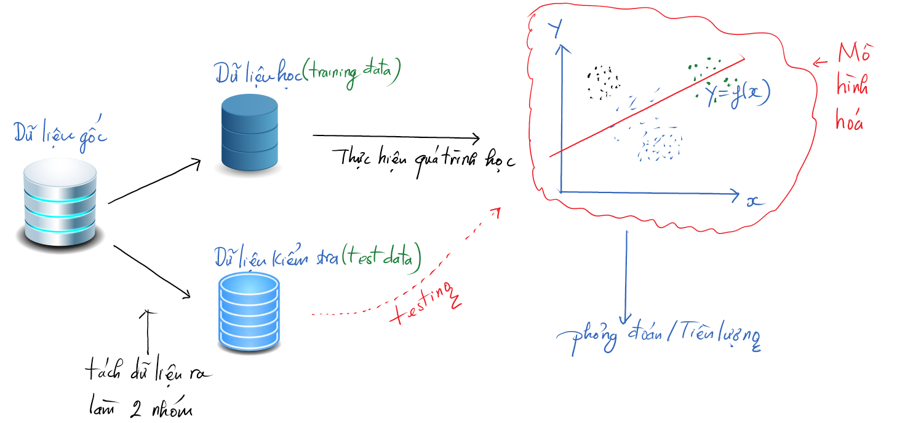

## Giới Thiệu về cách nhiệm vụ của công tác mô hình hóa

- Phân loại (Classification): Quyết định nếu thông tin thuộc một nhóm này hay nhóm khác
- Ghi điểm (Scoring): Tiên lượng/tính toán một giá trị số (ví dụ như giá cả, lượng mưa, hay đơn giản là xác xuất)
- Xếp hạng (ranking): Học để xắp xếp thứ tự các đối tượng theo sở thích
- Xếp nhóm (Clustering): Nhóm các đối tượng theo tính chất giống nhau
- Tìm mối liên hệ (finding relations): Tìm mối tương quan hay nguyên nhân gây ảnh hưởng thấy trong dữ liệu
- Mô tả đặc điểm (Characterization): Vẽ biểu đồ và tạo ra báo cáo từ dữ liệu.


## Lựa Chọn và Đánh Giá các Mô Hình

Làm thế nào để lựa chọn một mô hình phù hợp để giải quyết một bài toán kinh doanh/kĩ thuật cụ thể

Làm thế nào để đánh giá chất lượng và tính hiệu quả của các mô hình

- Bản đồ hóa các vấn đề liên quan đến công việc tới các nhiệm vụ của học máy
- Đánh giá chất lượng mô hình
- Kiểm định lại mô hình


### Bản đồ hóa

```{r, echo=FALSE, out.width="60%", fig.cap="", fig.align = 'center'}

```

#### Phân loại (Classification)

```{r attr.source="style='display:inline-block;'", collapse=TRUE, echo = FALSE, message=FALSE,warning=FALSE}
library(readxl)
data=read_excel("../Data/modelling.xlsx",sheet="classification-methods")
library(DT)
p<-datatable(data,options = list(dom = 't'),rownames = FALSE)
p
```

Các ví dụ

- Phân tích và tiên đoán hành vi của khách hàng
- Phân loại tài liệu
- Lọc thư rác
- Phân loại ảnh
- Phân loại thông tin trang web
- Tiên đoán tỷ lệ bấm vào quảng cáo
- Phân loại sản phẩm
- Phân loại Malware
- Phân tích tính nhạy cảm của hình ảnh
- Phỏng đoán lỗi
- ETC


#### Ghi điểm (Scoring)

- Phương pháp hồi qui tuyến tính
- Phương pháp hồi qui nhị thức

#### Làm việc khi không biết đến các đích cụ thể

Các phương pháp đã được đề cập đòi hỏi chúng ta phải có một bộ dữ liệu học về các tình huống mà chúng ta đã biết trước kết quả. Nhưng trong thực tế thì chúng ta chưa chắc đã biết chắc chắn các biến đầu ra. Thay vào đó, chúng ta muốn quan tâm tới các hình thái học (patterns) và các mối quan hệ trong dữ liệu để từ đó chúng ta có thể hiểu được phần nào các đối tượng cần quan tâm (khách hàng hay một vấn đề nào đó trong kinh doanh).

Các tính huống này thì liên quan đến một dạng tiếp cận trong phân tích dữ liệu gọi là "Học mà không có hướng dẫn/giám sát". Với trường hợp này, chúng ta thường dùng các phương pháp nhóm (clustering).

- Phân nhóm K-means (K-means clustering)
- Thuật toán Apriori để tìm ra các qui luật liên kết
- Hàng xóm gần nhất


## Các Phương Pháp Ghi Nhớ (Memorization Methods)

Tiên đoán/ước lượng dựa chủ yếu vào thông số thống kê cơ bản: 

- Các bảng tra cứu (lookup tables)
- Các phương pháp hàng xóm gần nhất (nearest neighbors)
- Phương pháp phân loại Naive Bayes
- Phương pháp cây quyết định (decision trees)

## Các phương pháp hàng xóm gần nhất (nearest neighbors)


## Phương pháp cây quyết định (decision trees)

Cây quyết định là một loại mô hình đơn giản dùng để tiên đoán theo từng mẩu (hay còn gọi là cành của cây). Dù đơn giản nhưng nó khá thú vị bởi vì [**GIẢ THUYẾT KHÔNG**](https://vi.wikipedia.org/wiki/Gi%E1%BA%A3_thuy%E1%BA%BFt_kh%C3%B4ng]) (Null Hypothesis) mà chúng ta cố gắng để làm tốt hơn thì thường là một hằng số cho cả gói dữ liệu, do đó chúng ta có thể xem cây quyết định như là một quá trình chia gói dữ liệu học thành những gói nhỏ và dùng hằng số đã được ghi nhớ cho từng gói dữ liệu nhỏ đó.

Phương pháp này thường được gọi là CART (Classification and Regression Trees) và được dùng để tiên lượng nhanh chóng cho cả các biến định lượng và biến định tính.


Ví dụ: **Ước tính lượng mưa hàng ngày.**


## Mô Hình Hồi Qui Tuyến Tính và Hồi Qui Nhị Thức
Các phương pháp lựa chọn các hàm đơn giản với cấu trúc cộng dồn (addictive structure)
- Hồi qui tuyến tính
- Hồi qui nhị thức

Các phương pháp này không những chỉ dùng để tiên lượng mà còn dùng để cung cấp thêm các thông tin liên quan đến mối quan hệ giữa các biến đầu vào và biến đầu ra.


## Các Phương Pháp không Giám Sát (unsupervized)

Các phương pháp trong học máy liên quan đến việc xếp nhóm (cluster) và liên quan đến tính liên kết (association). 

Các phương pháp này không nhằm tiên đoán chính xác kết quả, mà chúng thường để dùng để tìm ra/phát hiện các mối quan hệ và cấu trúc ẩn trong dữ liệu.


